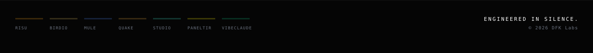

 

## `///` DEPLOYMENTS

<table>
<tr>
<td width="50%"></td>
<td width="50%"></td>
</tr>
<tr>
<td width="50%"></td>
<td width="50%"></td>
</tr>
<tr>
<td width="50%"></td>
<td width="50%"></td>
</tr>
</table>

**[dfklabs.com](https://dfklabs.com)** — the portal the six of them hang from.
Static HTML on Vercel. No framework, no build step, push to deploy.

 

## `///` OPEN SOURCE

 

## `///` THE RULES THIS PLACE RUNS ON

<table>
<tr>
<td width="34%"><b>Local-first, or not at all</b></td>
<td>No accounts, no servers, no analytics, no third-party SDKs. Backup lives in <i>your</i> iCloud, where we cannot read it. An app that can't make the claim honestly doesn't make it.</td>
</tr>
<tr>
<td><b>Claims in the UI must be true</b></td>
<td>Every number names what it rests on — the sample size, the catalogue years, the study. An insight stays silent until the data behind it is real.</td>
</tr>
<tr>
<td><b>Generated, then committed</b></td>
<td>Pages, sitemaps, social cards, icons and the panels above come out of a generator with a <code>--check</code> mode that CI runs. The output is in the repo, so nothing here needs a build step.</td>
</tr>
<tr>
<td><b>The check is the design</b></td>
<td>Contrast ratios are computed, not eyeballed. Brand colour lives in one registry and a check fails if a hex turns up anywhere else. <code>--text-mute</code> failed its own check at 3.96:1, so it moved.</td>
</tr>
<tr>
<td><b>One indexable URL per language</b></td>
<td>Not a runtime switcher: a real static page per locale, each with its own canonical, <code>hreflang</code> set and social card. Quake ships fourteen.</td>
</tr>
<tr>
<td><b>One implementation per job</b></td>
<td>One share path. One notification scheduler. One place a colour is decided. Two of anything is where the next bug lives.</td>
</tr>
<tr>
<td><b>The panel above is the real catalogue</b></td>
<td>Quake's trace is not drawn from taste. <code>.github/workflows/refresh-quake.yml</code> pulls two USGS feeds every six hours: the day feed draws the trace and the per-2 h bars, and the 30-day feed carries the b-value — fitted by Aki's estimator above an Mc found by maximum curvature, over the US box, because that is the only region the M2.5+ feed is complete across. A fit outside 0.6–1.6 is refused and the count shown instead. The panel names all of it. If a feed is down the last snapshot stands.</td>
</tr>
</table>

 

<!--
  Every panel above is a committed SVG, generated by assets/build.py.
  Change a palette, a blurb, a mark or an instrument there and re-run:

      python3 assets/build.py           # from the committed snapshot
      python3 assets/build.py --live    # refresh Quake from the USGS feed

  Nothing on this page is fetched from a third party at render time, and
  every animation is CSS, so a viewer who asks for less motion gets the
  finished frame instead.
-->
