<picture>
  <source media="(prefers-color-scheme: dark)" srcset="assets/header-dark.svg">
  <source media="(prefers-color-scheme: light)" srcset="assets/header-light.svg">
  
</picture>

 

 

  

---

## // Shipping

<table>
<tr>
<td width="50%" valign="top">

### 🦅 &nbsp;Birdio

**Every round, remembered.**

Golf and minigolf tracker for iPhone. A WHS-style index from your best 8 of the
last 20 rounds, GIR / fairways / scrambling / three-putts, performance by
weather, and coaching drills built from your own numbers. Climb the bird ladder
from Hatchling to Condor as the handicap falls.

`Swift` · `SwiftUI` · `StoreKit` · `16 languages` · `on-device`

**[birdio.dfklabs.com →](https://birdio.dfklabs.com)**

</td>
<td width="50%" valign="top">

### 🫏 &nbsp;Mule

**Every rep, remembered.**

Strength log for iPhone and Apple Watch. Every session scored against your own
baseline, a body map of what you actually trained, a Strength Index against
real standards — and a coach that **cites the study behind every tip**, so you
can check it instead of trusting it.

`Swift` · `watchOS` · `HealthKit` · `Swift Charts` · `Live Activity`

**[mule.dfklabs.com →](https://mule.dfklabs.com)**

</td>
</tr>
<tr>
<td width="50%" valign="top">

### 🌋 &nbsp;Quakes

**Statistics, never prediction.**

Installable PWA over the live USGS and EMSC catalogues. Alerts only for the
places you pick, an animated 24-hour replay, Gutenberg–Richter fits with a real
b-value, and Reasenberg–Jones aftershock outlooks. Every card names what it
rests on: event count, years covered, completeness magnitude.

`PWA` · `Python build` · `14 languages` · `no backend`

**[quake.dfklabs.com →](https://quake.dfklabs.com)**

</td>
<td width="50%" valign="top">

### 🐿️ &nbsp;Risu

**The documents that expire.**

A private vault for passport, ID, licence and insurance — photographed or
scanned, with the dates read off them and calm alerts early enough that
renewing is still easy. One share path, through redaction. Nothing leaves
the device.

`iOS 26` · `SwiftUI` · `SwiftData` · `Swift 6` · `zero dependencies`

**[risu.dfklabs.com →](https://risu.dfklabs.com)**

</td>
</tr>
<tr>
<td width="50%" valign="top">

### 🛠️ &nbsp;DFK Studio

**Tools that run in your browser.**

Thirty-odd converters, encoders and image tools — load one, switch the network
off, and it keeps working. Behind a private door on the same site: App Store
screenshot composition, store copy against every locale's limit, campaign
links, release boards.

`Vanilla JS` · `generated pages` · `each tool installable`

**[studio.dfklabs.com →](https://studio.dfklabs.com)**

</td>
<td width="50%" valign="top">

### 🎛️ &nbsp;Paneltir

**Structure and behaviour. Never colour.**

The admin-panel UI kit behind every DFK board: page frame, kanban with drag and
drop that actually works on iOS touch, detail sheets, theming. It ships no
default colour on purpose — a forgotten token renders bare, which gets noticed.

`React` · `TypeScript` · `pointer events` · `proprietary`

**[paneltir.dfklabs.com →](https://paneltir.dfklabs.com)**

</td>
</tr>
</table>

**[⬛ dfklabs.com](https://dfklabs.com)** — the portal that ties them together.
Pure static HTML, no framework, no build step, push to deploy.

---

## // Open source

 

---

## // How things are built here

|  |  |
| :--- | :--- |
| 🔒 **Local-first, or not at all** | No accounts, no servers, no analytics, no third-party SDKs. Backup lives in *your* iCloud. If an app can't make the claim honestly, it doesn't make it. |
| 📎 **Claims in the UI must be true** | Every number names what it rests on — sample size, catalogue years, the study. An insight stays silent until the data is real. |
| ⚙️ **Generated, then committed** | Pages, sitemaps, social cards and icons come out of a generator with a `--check` mode CI runs. The output is in the repo, so the sites keep their no-build-step property. |
| 🧪 **The check is the design** | Contrast ratios are computed, not eyeballed. Brand colour lives in one registry and a check fails if a hex creeps in anywhere else. |
| 🌍 **One indexable URL per language** | Not a runtime switcher: a real static page per locale, with its own canonical, `hreflang` set and social card. |
| ⬛ **Engineered in silence** | Small surface, decided once, written down. |

---

  

<picture>
<source media="(prefers-color-scheme: dark)" srcset="https://raw.githubusercontent.com/daifukus/daifukus/output/github-snake-dark.svg"/>
<source media="(prefers-color-scheme: light)" srcset="https://raw.githubusercontent.com/daifukus/daifukus/output/github-snake.svg"/>

</picture>

  

**© 2025–2026 DFK Labs** · *Engineered in Silence.* · [hola@dfklabs.com](mailto:hola@dfklabs.com)

